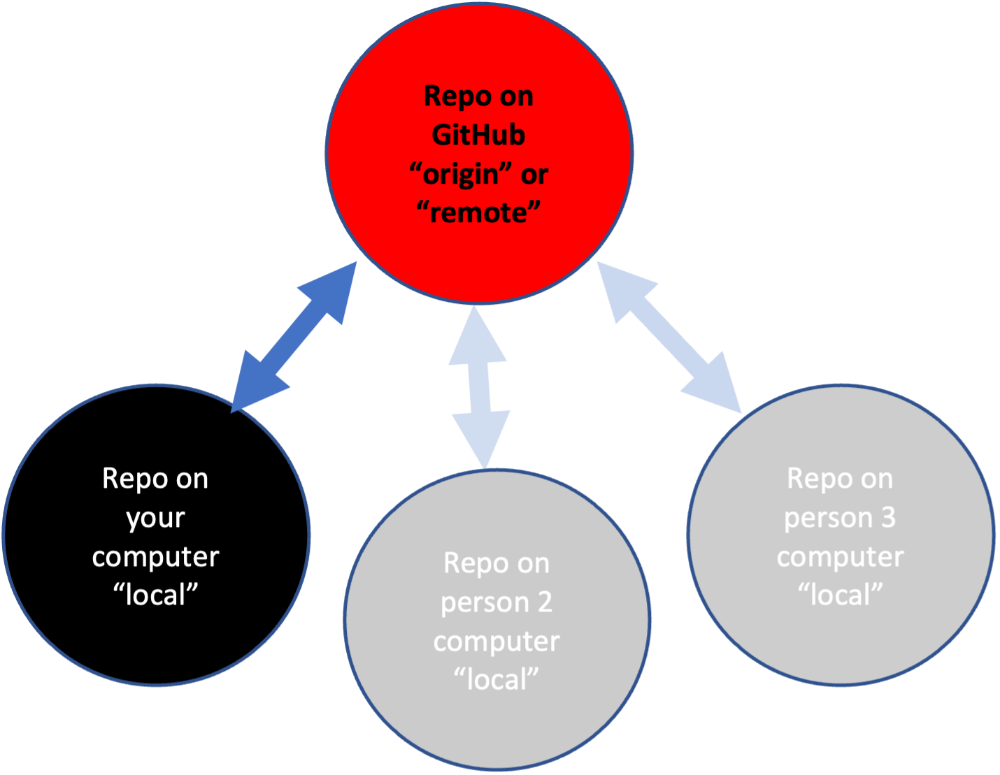

::: {.callout-note icon=false}

## Learning Objectives

-   What is version control?
-   The git jargon
-   The 4 basic skills

:::

::: {.callout-note icon="false"}

## What is Git and GitHub?

**Git** A program to track your file changes and create a history of those changes. Creates a 'container' for a set of files called a repository.

**GitHub** A website to host these repositories and allow you to sync local copies (on your computer) to the website. *Lots* of functionality built on top of this.

{width=200px}

## Some basic Git jargon

* **Repo** Repository. It is your code and the record of your changes. This record and also the status of your repo is a hidden folder called `.git` . You have a local repo and a remote repo. The remote repo is on GitHub (for in our case) is called `origin`. The local repo is on the JupyterHub.
* **Stage** Tell Git which changes you want to commit (write to the repo history).
* **Commit** Write a note about what change the staged files and "commit" that note to the repository record. You are also tagging this state of the repo and you could go back to this state if you wanted.
* **Push** Push local changes (commits) up to the remote repository on GitHub (`origin`).
* **Pull** Pull changes on GitHub into the local repository on the JupyterHub.
* **Git GUIs** A graphical interface for Git (which is command line). Today I will use `jupyterlab-git` which we have installed on JupyterHub.
* **Shell** A terminal window where we can issue `git` commands.

## Overview

Today I will cover the four basic Git/GitHub skills. The goal for today is to first get you comfortable with the basic skills and terminology. We will use what is called a  "trunk-based workflow".

### Simple Trunk-based Workflow:

* Make local (on your computer) changes to code.
* Record what those changes were about and commit to the code change record (history).
* Push those changes to your remote repository (aka origin)

We'll do this

## The Key Skills

These basic skills are all you need to learn to get started:

* Skill 1: Create a blank repo on GitHub (the remote or origin)
* Skill 2: Clone your **GitHub** repo to your local computer (in our case the JHub)
* Skill 3: Make some changes and commit those local changes
* Skill 4: Push the changes to GitHub (the remote or origin)

* Skill 1b: Create a new repo from some else's GitHub repository

In the next tutorials, you will practice these in RStudio or JuptyerHub.

