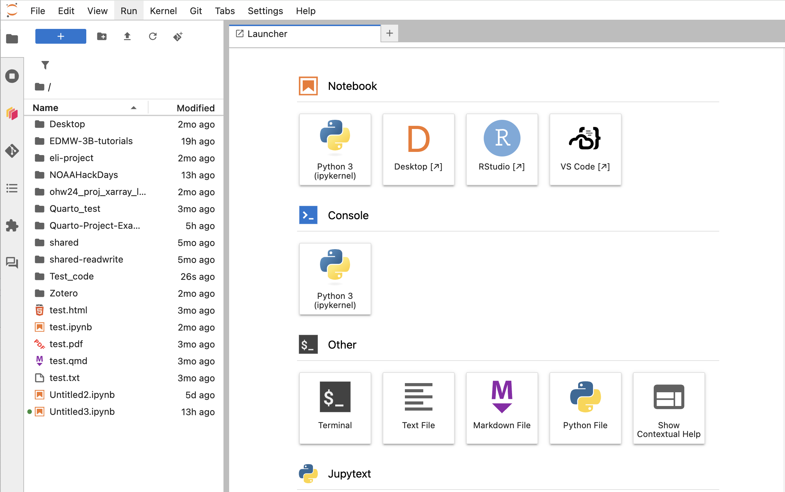
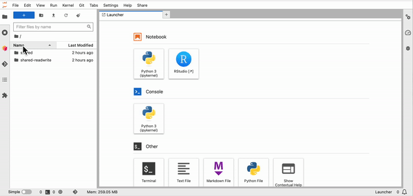

::: {.callout-note icon=false}

## Learning Objectives

- Basic navigation within JupyterLab
- How to restart the JHub
- How to open a terminal window

:::


When you start the JupyterHub, you will be in JupyterLab. From there you can click on the RStudio box and open RStudio. However for this tutorial, we will stay in JuptyerLab.

## Terminal/Shell

Log into the JupyterHub. If you do not see this



Then go to File \> New Launcher

Click on the "Terminal" box to open a new terminal window.

### Shell or Terminal Basics

1.  [What is Terminal or Shell?](https://swcarpentry.github.io/shell-novice/01-intro/index.html)
2.  [Navigating Files and Directories](https://swcarpentry.github.io/shell-novice/02-filedir/index.html)
3.  [Working with Files and Directories](https://swcarpentry.github.io/shell-novice/03-create/index.html)
4.  Optional: Detailed self-paced lesson on running scripts from the shell: [Shell Lesson from Software Carpentry](http://swcarpentry.github.io/shell-novice/)

Basic shell commands: 

-   `pwd` where am I
-   `cd nameofdir` move into a directory
-   `cd ..` move up a directory
-   `ls` list the files in the current directory
-   `ls -a` list the files including hidden files
-   `ls -l` list the files with more info
-   `cat filename` print out the contents of a file

### Let's try

```         
ls
ls -a
cd shared
ls
```

### Close the terminal

Just click on the X in the terminal tab

## File Navigation

In the far left, you will see a line of icons. The top one is a folder and allows us to move around our file system.

1.  Click on `shared`. Now you can see the files in the shared directory.

2.  Click on `shell-tutorial`. Then click on `lesson1.sh`. The file opens. You won't be able to save changes here because you don't have write permission on this drive.

3.  Click on the folder icon that looks like this. Click on the actual folder image. 

    Now it should look like this folder / 
    
    This shows me doing this
    
    
    
4. Create a new folder. 

    * Next to the blue rectange with a +, is a grey folder with a +. Click that to create a new folder, called `lesson-scripts`.
    * Then click on `lesson-scripts` to enter the folder
    
    
    
5. Create a new file

    * Create with File > New > Text file
    * The file will open and you can edit it.
    * Save with File > Save Text

6. Delete a file

    * Delete a file by right-clicking on it and clicking "Delete"
    
## Create a new Jupyter notebook

## Stop and Restart the JHub

